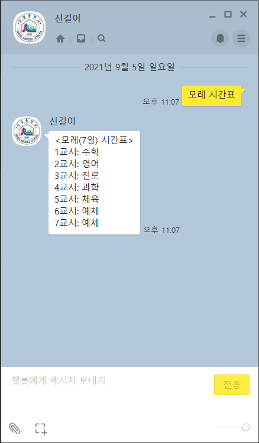

# 신길이

## 기능

### 시간표 조회

### 사용자 정보 수정

### 도움말 출력

## 시작하기

**[여기](http://pf.kakao.com/_vxdxbJs/chat)를 클릭하십시오. 바로 신길이와 대화하실 수 있습니다.**

## 기여하기

다양한 방법으로 이 프로젝트에 기여하실 수 있습니다. 예를 들어:

- [버그 제보하기/기능 요청하기](https://github.com/HolyDiamonds7/SingilE/issues)
- [바뀐 소스 코드](https://github.com/HolyDiamonds7/SingilE/pulls) 검토하기

만약 소스 코드에 직접적으로 기여하고 싶으시다면, [가이드라인](GUIDELINE.md)을 확인해 주시기 바랍니다.

## TODO

- [ ] Add docstring
- [ ] Implement cafeteria feature
- [ ] Use async/await
- [ ] Use FastAPI, instead of Flask

## License

Copyright (c) Minjoon Kim. All rights reserved.

Licensed under the [MIT](LICENSE.txt) license.
